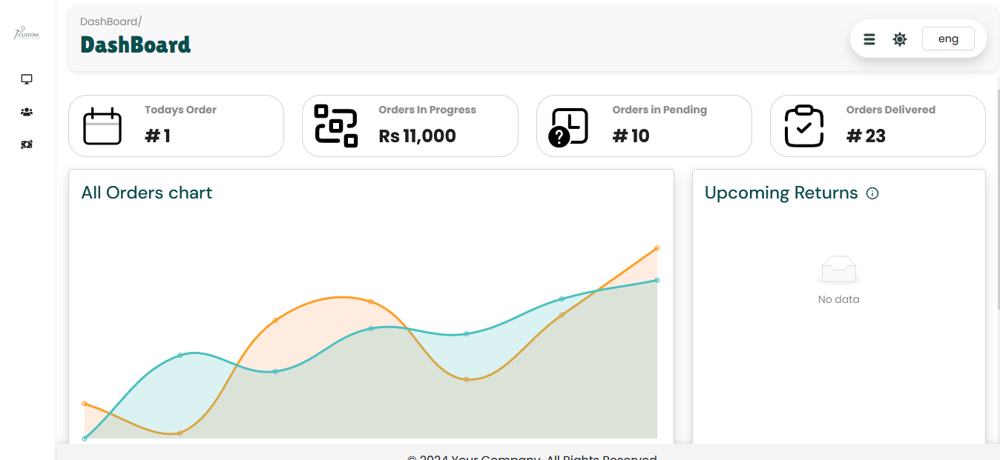

<h1 align="center">
🌐 MERN Stack
</h1>
<p align="center">
MongoDB, Expressjs, React/Recoil, Nodejs
</p>

> MERN is a fullstack implementation in MongoDB, Expressjs, React/Recoil, Nodejs.

MERN stack is the idea of using Javascript/Node for fullstack web development. you will be able to see two folders Frontend and Backend

## 📌 About the Project
This project is a tailor management web portal designed to streamline and simplify the cloth stitching workflow. In Version 1, the portal allows tailors to perform full CRUD operations on stitching orders, manage order statuses, and easily search through existing records. It aims to bring structure and efficiency to tailoring tasks, replacing manual tracking with a digital solution.


## clone or download

```terminal
$ git clone https://github.com/BinaryCodOrg/Tailor-Project.git
$ cd Backend
$ yarn # or npm i
$ cd .. && cd Frontend
$ yarn # or npm i
```

(Remember: you have to run npm i after opening folder)

# Usage (run fullstack app on your machine)

## Prerequisites

- [MongoDB](https://gist.github.com/nrollr/9f523ae17ecdbb50311980503409aeb3)
- [Node](https://nodejs.org/en/download/) ^10.0.0
- [npm](https://nodejs.org/en/download/package-manager/)

notice, you need client and server runs concurrently in different terminal session, in order to make them talk to each other

## Client-side usage(PORT: 3000)

```terminal
$ cd Frontend          // go to client folder
$ yarn # or npm i    // npm install packages
$ npm run dev        // run it locally

// deployment for client app
$ npm run build // this will compile the react code using webpack and generate a folder called docs in the root level
$ npm run start // this will run the files in docs, this behavior is exactly the same how gh-pages will run your static site
```

## Server-side usage(PORT: 8000)

### Prepare your secret

run the script at the first level:

(You need to add a JWT_SECRET in .env to connect to MongoDB)

```terminal
// in the root level
$ cd Backend
$ echo "JWT_SECRET=YOUR_JWT_SECRET" >> src/.env
$ echo "Mongos_DB_connection=YOUR_Mongos_DB_connection_link" >> src/.env
```

### Start

```terminal
$ cd Backend   // go to server folder
$ npm i       // npm install packages
$ nodemon app // run it locally
```

# Dependencies(tech-stacks)

| Client-side                         | Server-side           |
| ---------------------------------- | --------------------- |
| @react-icons/all-files: ^4.1.0     | cors: ^2.8.5          |
| antd: ^5.21.6                      | dotenv: ^16.4.7       |
| antd-style: ^3.7.1                 | express: ^4.21.2      |
| aos: ^2.3.4                        | joi: ^17.13.3         |
| axios: ^1.7.7                      | mongoose: ^8.10.1     |
| bootstrap: ^5.3.3                  |                       |
| chart.js: ^4.4.6                   |                       |
| formik: ^2.4.6                     |                       |
| jspdf: ^2.5.1                      |                       |
| jspdf-autotable: ^3.8.2            |                       |
| react: ^18.3.1                     |                       |
| react-bootstrap: ^2.10.5           |                       |
| react-countup: ^6.5.3              |                       |
| react-datepicker: ^7.5.0           |                       |
| react-dom: ^18.3.1                 |                       |
| react-icons: ^5.3.0                |                       |
| react-router-dom: ^6.27.0          |                       |
| react-scroll: ^1.9.0               |                       |
| react-select: ^5.8.2               |                       |
| recoil: ^0.7.7                     |                       |
| vite-plugin-svgr: ^4.3.0           |                       |
| yup: ^1.4.0                        |                       |


# Screenshots of this project

User visit public and Home page


## Author

[BinaryCod](https://binarycod.com)